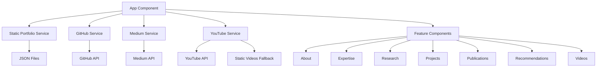

# 🏗️ Arquitectura del Portafolio - Jairzinho Santos

## 📋 Estructura Modular

### **Principios de Diseño**
- **Separación de responsabilidades:** Cada componente tiene una función específica
- **Clean Code:** Código legible, mantenible y bien documentado
- **Modularidad:** Componentes independientes y reutilizables
- **Datos dinámicos:** Configuración mediante archivos JSON externos

## 🗂️ Organización del Código

### **Componentes Modulares**
```
src/app/
├── layout/                    # Componentes de estructura
│   ├── header/               # Navegación y temas
│   └── footer/               # Pie de página
├── features/                 # Funcionalidades principales
│   ├── about/               # Información personal
│   ├── expertise/           # Áreas de especialización
│   ├── research/           # Intereses de investigación
│   ├── projects/           # Proyectos de GitHub
│   ├── publications/       # Artículos de Medium
│   ├── recommendations/    # Recomendaciones de LinkedIn
│   └── videos/             # Videos de YouTube
├── shared/                  # Componentes compartidos
│   └── components/
│       └── carousel/        # Carrusel reutilizable
├── services/               # Servicios de datos
│   ├── github.service.ts   # API de GitHub
│   ├── medium.service.ts   # API de Medium
│   ├── youtube.service.ts  # API de YouTube
│   ├── static-videos.service.ts     # Videos estáticos
│   └── static-portfolio.service.ts  # Datos JSON estáticos
└── core/                   # Configuración central
    ├── constants/          # Constantes y configuración
    ├── interfaces/         # Tipos de datos TypeScript
    └── utils/              # Utilidades comunes
```

### **Gestión de Datos**

#### **Sistema de Datos Estáticos (JSON)**
```
src/assets/data/
├── personal-info.json      # Información personal y redes sociales
├── expertise.json          # Áreas de especialización
├── research-interests.json # Intereses de investigación
├── recommendations.json    # Recomendaciones de LinkedIn
├── static-videos.json      # Videos cuando API falla
└── README.md              # Documentación del sistema
```

#### **APIs Dinámicas**
- **GitHub API:** Proyectos en tiempo real
- **Medium API:** Publicaciones actuales
- **YouTube API:** Videos del canal (con fallback estático)

### **Flujo de Datos**



## 🎯 Patrones Implementados

### **1. Component Pattern**
- Cada sección es un componente independiente
- Inputs para recibir datos
- Outputs para comunicación con el padre
- Estilos encapsulados por componente

### **2. Service Pattern**
- Servicios inyectables para manejo de datos
- Separación de lógica de negocio
- Observables para programación reactiva
- Manejo de errores centralizado

### **3. Strategy Pattern**
- Múltiples fuentes de datos (API + JSON)
- Fallbacks automáticos cuando APIs fallan
- Configuración dinámica por ambiente

### **4. Observer Pattern**
- Uso de RxJS Observables
- Detección automática de cambios
- Programación reactiva

## 🎨 Sistema de Estilos

### **Metodología BEM + Scoped Styles**
- Estilos encapsulados por componente
- Nomenclatura consistente
- Tema claro/oscuro unificado

### **Variables de Color Unificadas**
```scss
// Colores minimalistas
$primary-gray: #6b7280;      // Iconos base
$dark-gray: #374151;         // Hover claro
$light-gray: #9ca3af;        // Hover oscuro
$accent-blue: #60a5fa;       // Acentos tema oscuro
```

## 🔧 Configuración Dinámica

### **Archivos de Configuración**
- `environment.ts` - Variables de entorno
- `portfolio.constants.ts` - Constantes de fallback
- `carousel.constants.ts` - Configuración de carruseles

### **Sistema de Temas**
- Detección automática del sistema
- Configuración manual (claro/oscuro/auto)
- Persistencia en localStorage

## 📦 Build y Deployment

### **Scripts NPM**
```json
{
  "start": "ng serve --hmr",                    // Desarrollo
  "build": "ng build",                          // Compilación
  "serve:ssr:portfolio": "node dist/.../server.mjs"  // Producción SSR
}
```

### **Server-Side Rendering**
- Pre-renderizado para SEO
- Hidratación en el cliente
- Puerto 4000 para producción

## 🧪 Principios de Clean Code

### **Naming Conventions**
- Variables: `camelCase`
- Componentes: `PascalCase`
- Archivos: `kebab-case`
- Métodos: `verboSustantivo()`

### **Organización del Código**
- Imports ordenados por tipo
- Métodos públicos antes que privados
- Lógica de negocio en servicios
- Presentación en componentes

### **Documentación**
- JSDoc para métodos complejos
- README para cada sistema
- Comentarios explicativos (no obvios)
- Arquitectura documentada

## 🚀 Escalabilidad

### **Agregar Nueva Sección**
1. Crear componente en `features/`
2. Definir interfaz en `core/interfaces/`
3. Crear servicio si necesita datos externos
4. Agregar al routing en `app.component.html`
5. Configurar estilos con tema claro/oscuro

### **Modificar Datos**
1. **Estáticos:** Editar archivos JSON en `assets/data/`
2. **Dinámicos:** Modificar servicios correspondientes
3. **Configuración:** Actualizar constantes en `core/`

## ⚡ Performance

### **Lazy Loading**
- Componentes cargados bajo demanda
- Imágenes con lazy loading nativo
- Tree shaking automático

### **Optimizaciones**
- OnPush change detection donde posible
- Observables con unsubscribe automático
- Imágenes optimizadas
- CSS minificado en producción

## 🛡️ Manejo de Errores

### **Estrategia de Fallbacks**
- APIs externas con datos de respaldo
- Mensajes de error amigables
- Degradación gradual de funcionalidades
- Logs informativos para debugging

Este diseño garantiza:
- ✅ **Mantenibilidad:** Código organizado y documentado
- ✅ **Escalabilidad:** Fácil agregar nuevas funcionalidades
- ✅ **Performance:** Optimizado para producción
- ✅ **UX:** Experiencia consistente y responsive 