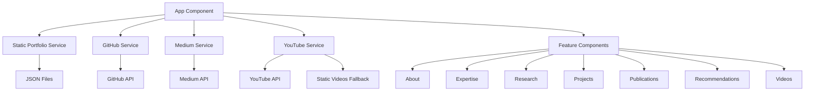

# Portfolio Architecture

## Modular Structure

### Design Principles
- Separation of concerns
- Clean Code
- Modularity
- Dynamic data through JSON

## Code Organization

### Modular Components
```
src/app/
├── layout/                    # Structural components
│   ├── header/               # Navigation and themes
│   └── footer/               # Footer
├── features/                 # Main functionalities
│   ├── about/               # Personal information
│   ├── expertise/           # Areas of expertise
│   ├── research/           # Research interests
│   ├── projects/           # GitHub projects
│   ├── publications/       # Medium articles
│   ├── recommendations/    # LinkedIn recommendations
│   └── videos/             # YouTube videos
├── shared/                  # Shared components
│   └── components/
│       └── carousel/        # Reusable carousel
├── services/               # Data services
│   ├── github.service.ts   # GitHub API
│   ├── medium.service.ts   # Medium API
│   ├── youtube.service.ts  # YouTube API
│   ├── static-videos.service.ts     # Static videos
│   └── static-portfolio.service.ts  # Static JSON data
└── core/                   # Core configuration
    ├── constants/          # Constants and configuration
    ├── interfaces/         # TypeScript data types
    └── utils/              # Common utilities
```

### Data Management

#### Static Data System
```
src/assets/data/
├── personal-info.json      # Personal information and social media
├── expertise.json          # Areas of expertise
├── research-interests.json # Research interests
├── recommendations.json    # LinkedIn recommendations
├── static-videos.json      # Videos when API fails
└── README.md              # System documentation
```

#### Dynamic APIs
- GitHub API: Real-time projects
- Medium API: Current publications
- YouTube API: Channel videos with static fallback

### Data Flow



## Implemented Patterns

### 1. Component Pattern
- Each section is an independent component
- Inputs to receive data
- Outputs for parent communication
- Component-encapsulated styles

### 2. Service Pattern
- Injectable services for data handling
- Business logic separation
- Observables for reactive programming
- Centralized error handling

### 3. Strategy Pattern
- Multiple data sources (API + JSON)
- Automatic fallbacks when APIs fail
- Dynamic configuration per environment

### 4. Observer Pattern
- RxJS Observables usage
- Automatic change detection
- Reactive programming

## Style System

### BEM + Scoped Styles Methodology
- Component-encapsulated styles
- Consistent nomenclature
- Unified light/dark theme

### Unified Color Variables
```scss
// Minimalist colors
$primary-gray: #6b7280;      // Base icons
$dark-gray: #374151;         // Light hover
$light-gray: #9ca3af;        // Dark hover
$accent-blue: #60a5fa;       // Dark theme accents
```

## Dynamic Configuration

### Configuration Files
- `environment.ts` - Environment variables
- `portfolio.constants.ts` - Fallback constants
- `carousel.constants.ts` - Carousel configuration

### Theme System
- Automatic system detection
- Manual configuration (light/dark/auto)
- localStorage persistence

## Build and Deployment

### NPM Scripts
```json
{
  "start": "ng serve --hmr",                    // Development
  "build": "ng build",                          // Build
  "serve:ssr:portfolio": "node dist/.../server.mjs"  // SSR Production
}
```

### Server-Side Rendering
- Pre-rendering for SEO
- Client-side hydration
- Port 4000 for production

## Clean Code Principles

### Naming Conventions
- Variables: `camelCase`
- Components: `PascalCase`
- Files: `kebab-case`
- Methods: `verbNoun()`

### Code Organization
- Imports ordered by type
- Public methods before private
- Business logic in services
- Presentation in components

### Documentation
- JSDoc for complex methods
- README for each system
- Explanatory comments (not obvious ones)
- Documented architecture

## Scalability

### Adding New Section
1. Create component in `features/`
2. Define interface in `core/interfaces/`
3. Create service if external data needed
4. Add to routing in `app.component.html`
5. Configure styles with light/dark theme

### Modifying Data
1. Static: Edit JSON files in `assets/data/`
2. Dynamic: Modify corresponding services
3. Configuration: Update constants in `core/`

## Performance

### Lazy Loading
- Components loaded on demand
- Native image lazy loading
- Automatic tree shaking

### Optimizations
- OnPush change detection where possible
- Observables with automatic unsubscribe
- Optimized images
- Minified CSS in production

## Error Handling

### Fallback Strategy
- External APIs with backup data
- User-friendly error messages
- Graceful feature degradation
- Informative logs for debugging

This design ensures:
- Maintainability: Organized and documented code
- Scalability: Easy to add new features
- Performance: Optimized for production
- UX: Consistent and responsive experience 